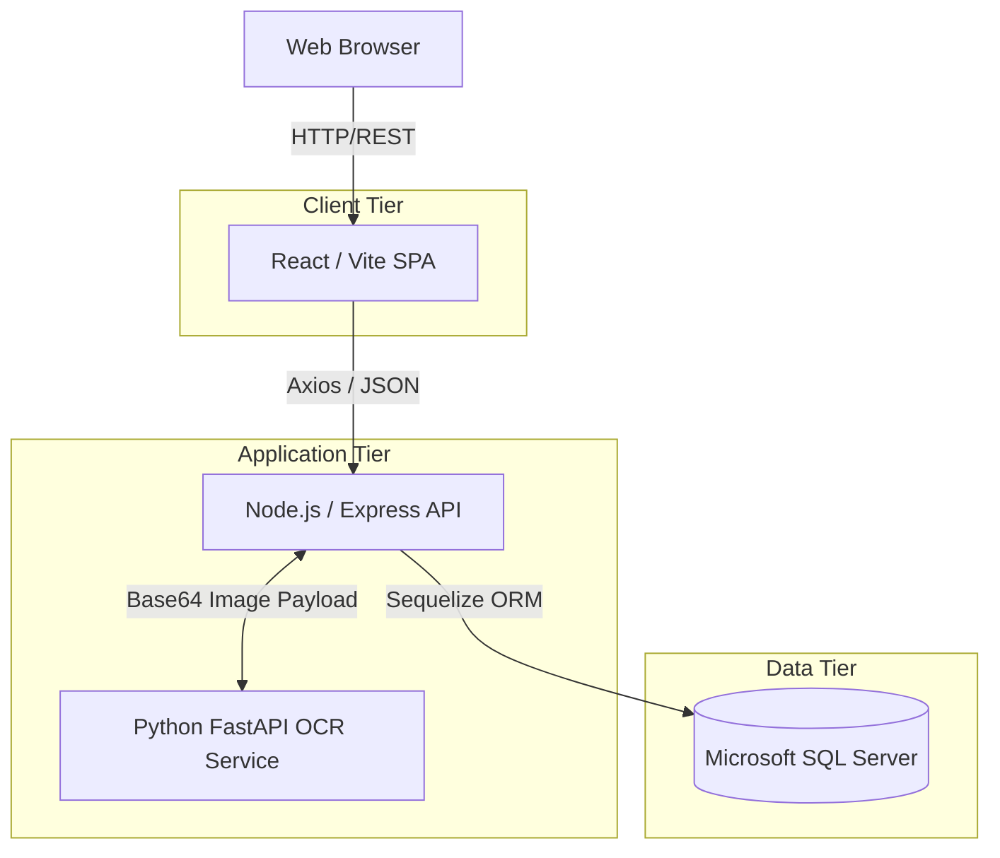
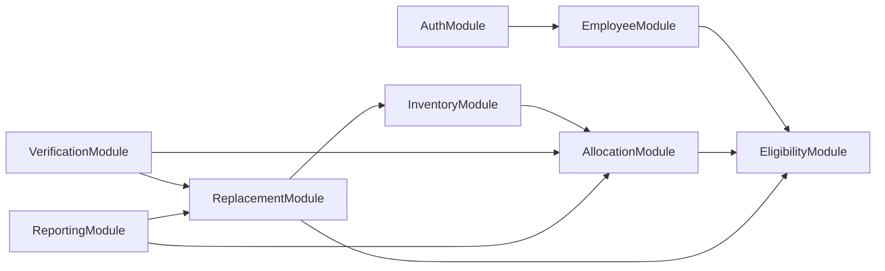
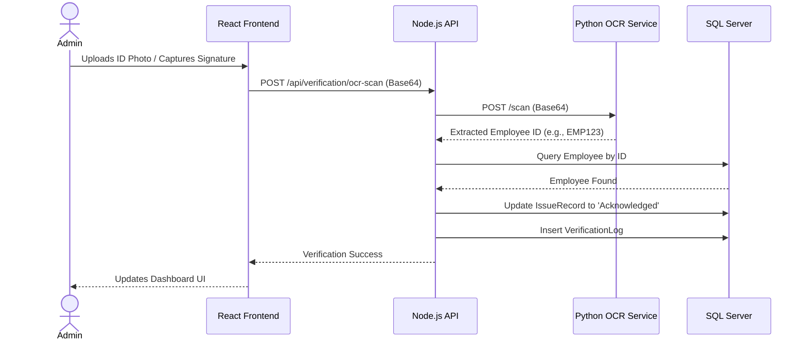
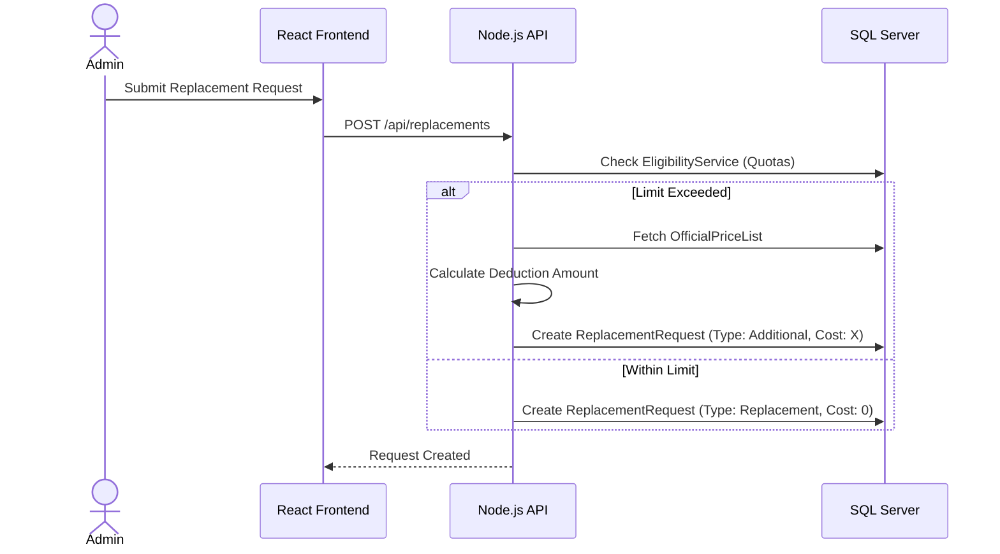
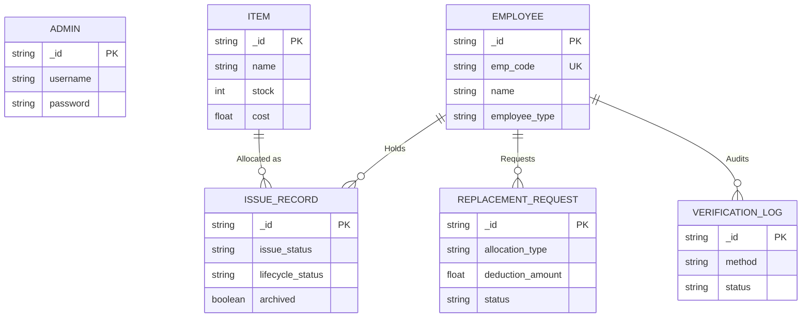

# PROVEXA - Enterprise Asset & Uniform Management System

## Project Title
**PROVEXA (Asset & Uniform Management System)**

## 0. Recent Updates (Changelog)
**Date: 2026-05-24**

- **UI/UX Refinements**: Redesigned the admin layout to resolve spacing issues and optimize data presentation.
- **Replacement Forms**: Fixed bug where the "Size" field was improperly validated in the background, causing form submissions to fail silently for non-apparel items.
- **Asset Profile Status**: Fixed hardcoded badges in the Employee Asset Profile. The profile now dynamically displays correct Replacement, Additional, and Standard asset tags based on true `allocation_type`.
- **Approval Modal Cost Visibility**: Fixed an issue where manual cost fields were erroneously displayed during standard free Replacements/Exchanges. The cost fields are now correctly hidden unless the workflow requires a deduction (e.g., Additional items).
- **Additional Cost Report Export**: Resolved an issue in `ReportService.js` where the "Additional Cost" Excel export artificially constrained the dataset to the current day. The export now accurately captures all historical records to match the dashboard totals perfectly.

## Project Purpose and Business Problem Solved
PROVEXA solves the operational challenges of tracking, allocating, and verifying physical assets (such as uniforms, safety gear, and IT equipment) issued to employees. Historically, these processes rely on manual ledgers or disconnected spreadsheets, leading to inventory shrinkage, disputes over asset handovers, unrecovered costs for extra items, and lack of compliance tracking. PROVEXA digitizes this entire lifecycle, enforcing strict eligibility rules, automating payroll deduction calculations for out-of-quota requests, and leveraging cutting-edge OCR and digital signature technologies to create non-repudiable proof of asset handover.

## Executive Summary
PROVEXA is a comprehensive, multi-tier web application designed for seamless enterprise asset tracking. It combines a highly responsive React (Vite) frontend, a robust Node.js/Express backend powered by Sequelize (SQL Server), and a dedicated Python FastAPI OCR microservice. The system automates the enforcement of asset quotas based on employee types (e.g., Intern vs. Permanent), streamlines replacement and approval workflows, mathematically proves handovers via ID scanning, and generates detailed financial and operational reports.

## Key Objectives
- **Centralized Inventory & Asset Ledger**: Provide a single, immutable source of truth for all physical assets.
- **Automated Policy Enforcement**: Dynamically calculate employee eligibility and flag out-of-policy requests.
- **Cost Recovery Automation**: Automatically identify additional/excess requests and calculate payroll deductions using an official price list.
- **Non-Repudiable Verification**: Enforce digital signatures or OCR-based ID card scans before acknowledging an asset handover.
- **Actionable Intelligence**: Deliver real-time dashboards and comprehensive Excel reports for HR and Payroll departments.

---

## Professional Table of Contents

1. [System Overview & Architecture](#system-overview--architecture)
2. [Core Functionalities & Features](#core-functionalities--features)
3. [User Roles and Permissions](#user-roles-and-permissions)
4. [Functional Modules & Relationships](#functional-modules--relationships)
5. [End-to-End Workflows & Diagrams](#end-to-end-workflows--diagrams)
6. [Database Structure & Documentation](#database-structure--documentation)
7. [API Architecture & Documentation](#api-architecture--documentation)
8. [Security, Validation & Error Handling](#security-validation--error-handling)
9. [Development & Setup Guide](#development--setup-guide)
10. [Production Deployment Architecture](#production-deployment-architecture-sql-server-express--pm2--iis)
11. [Deployment Steps](#deployment-steps-windows-production-setup)
12. [Maintenance & Checklists](#maintenance--checklists)

---

## System Overview & Architecture

### System Overview
PROVEXA uses a decoupled architecture. The React SPA communicates with a Node.js REST API, which interfaces with a SQL Server database via the Sequelize ORM. A specialized Python microservice handles computationally expensive OCR tasks asynchronously.

### Application Architecture

#### Frontend Structure (React/Vite)
- **State Management**: `@tanstack/react-query` for asynchronous server state caching/invalidation; React `useState`/`useContext` for local UI state.
- **Routing Structure**: `react-router-dom` with a protected layout (`Layout.jsx`) guarding authenticated routes.
- **Component Architecture**: Atomic design principles with reusable base components (`/components/ui`) and distinct page views (`/pages`).

#### Backend Structure (Node.js/Express)
- **Controller/Router Layer**: Express routers map HTTP endpoints to Service layer functions.
- **Service Layer Explanation**: Thick services (`IssueService.js`, `EligibilityService.js`) encapsulate all business logic, keeping routes thin and testable.
- **Middleware Explanation**: `auth.js` intercepts requests to validate JWT cookies before granting access to protected routes.
- **File Upload Mechanism**: Uses base64 JSON payloads instead of `multipart/form-data` to handle digital signatures and ID images natively.
- **Image/Document Handling Process**: Base64 strings are decoded and saved locally to `/server/public/signatures/` or forwarded directly to the OCR microservice via internal HTTP requests.

#### Database Structure (SQL Server)
- Relational schema optimized for fast timeline reconstruction. Soft deletes/archiving (using `lifecycle_status` and `archived` flags) are heavily utilized to preserve historical audit trails without losing data integrity.

### Mermaid Architecture Diagrams

#### System Architecture Diagram


#### Module Dependency Diagram


---

## Core Functionalities & Features

### Complete Feature List
- Secure JWT-based Authentication
- Comprehensive Dashboard with Real-time Metrics
- Employee Profile & Asset Timeline Tracking
- Automated Asset Quota & Eligibility Calculation
- Bulk and Individual Asset Issuance
- Replacement & Exchange Workflows
- Automated Payroll Deduction Calculations (Additional Requests)
- Digital Signature Capture & Storage
- Physical ID Card OCR Scanning (PaddleOCR/EasyOCR based)
- Asset Return & Renewal Lifecycles
- Exportable Excel Reports (Cost Deductions, Active Issues, Replacements)

### Feature Matrix
| Feature | Supported | Description |
|---|---|---|
| Role-based Access | Yes | Single Admin role implemented; extensible. |
| Multi-tenancy | No | Single organization deployment. |
| Automatic Quotas | Yes | Handled via `EligibilityService` & `AllocationConfig`. |
| Cost Calculation | Yes | Handled via `OfficialPriceList`. |
| Digital Signatures | Yes | Captured via HTML5 Canvas. |
| ID Card OCR | Yes | Handled via Python microservice. |
| Email Notifications | No | Not currently implemented in the codebase. |

---

## User Roles and Permissions

Currently, PROVEXA implements a centralized management model.

### User Role Matrix
| Role | View Dashboard | Manage Employees | Issue Assets | Approve Replacements | Verify Handovers | Generate Reports |
|---|---|---|---|---|---|---|
| **Admin** | ✅ | ✅ | ✅ | ✅ | ✅ | ✅ |
| **Employee** | ❌ (Physical interactions only via Admin terminal) | ❌ | ❌ | ❌ | ❌ | ❌ |

---

## Functional Modules & Relationships

### Business Logic Overview
The core business logic resides in resolving the conflict between what an employee *wants* and what they are *eligible* for. The `EligibilityService` dynamically calculates this by comparing an employee's `employee_type` against the `AllocationConfig`, minus their currently active `IssueRecords`.

1. **Authentication Flow**: Login -> Validate Hash -> Generate JWT -> Set HTTP-Only Cookie.
2. **Employee Management**: CRUD operations for employee metadata.
3. **Inventory Workflow**: Categories created -> Items created under categories -> Stock managed.
4. **Transaction (Asset Management) Workflow**: Issue requested -> Eligibility checked -> Record created (`Pending`) -> Stock decremented.
5. **Approval Workflow**: Replacement requested -> Marked `Pending` -> Admin Reviews -> Marked `Approved`.
6. **OCR Verification Workflow**: Card Photographed -> Sent to Python Service -> Image Preprocessed (CLAHE/Otsu) -> Digits Extracted -> Cross-referenced with Database -> Record Marked `Acknowledged`.
7. **Reporting & Analytics**: Data queried -> Formatted into Excel via `exceljs` -> Downloaded by client.
8. **Audit Logging**: All verification attempts (success or fail) are logged in `VerificationLog`.

---

## End-to-End Workflows & Diagrams

### Sequence Diagrams for Major Workflows

#### Asset Verification & Handover (OCR & Signature)


#### Replacement Request & Cost Deduction


---

## Database Structure & Documentation

### Database Entities and Relationships (ER Diagram)


### Database Documentation Tables
| Table | Purpose | Important Columns |
|---|---|---|
| `Admins` | System administrators. | `username`, `password`, `role` |
| `Employees` | Workforce roster and metadata. | `emp_code`, `department`, `employee_type`, `sizes_*` |
| `Items` | Physical inventory ledger. | `name`, `stock`, `cost`, `frequency_days` |
| `IssueRecords` | Active and historical asset allocations. | `issued_date`, `next_due_date`, `issue_status`, `lifecycle_status`, `archived` |
| `ReplacementRequests` | Audit of exchanged or additional items. | `allocation_type`, `deduction_amount`, `payment_status`, `status` |
| `VerificationLogs` | Immutable ledger of handover verifications. | `method`, `status`, `ocr_confidence`, `signature_path` |
| `AllocationConfigs` | Policy definitions for item quotas. | `item_type`, `permanent_quantity`, `intern_quantity` |
| `OfficialPriceLists` | Cost matrix for payroll deductions. | `item_name`, `gender`, `price` |

---

## API Architecture & Documentation

### Request and Response Examples
**Example: OCR Scan Request**
```json
// POST /api/verification/ocr-scan
{
    "image": "data:image/jpeg;base64,/9j/4AAQSkZJ...",
    "device_info": "Chrome Windows"
}
```
**Example: OCR Scan Response**
```json
{
    "status": "Verified",
    "message": "John Doe verified successfully",
    "employee": { "_id": "uuid-123", "emp_code": "EMP001", "name": "John Doe" },
    "confidence": 0.95
}
```

### API Documentation Tables

#### Authentication Module (`/api/auth`)
| Endpoint | Method | Purpose | Auth Required |
|---|---|---|---|
| `/login` | POST | Authenticates Admin & sets HTTP-only cookie. | No |
| `/me` | GET | Validates current session token. | Yes |
| `/logout` | POST | Clears session cookie. | Yes |

#### Employee Module (`/api/employees`)
| Endpoint | Method | Purpose | Auth Required |
|---|---|---|---|
| `/` | GET | Fetches all employees (supports pagination/search). | Yes |
| `/:id/asset-profile`| GET | Computes real-time asset allocations and risks. | Yes |
| `/` | POST | Creates a new employee. | Yes |

#### Issue & Allocation Module (`/api/issues`)
| Endpoint | Method | Purpose | Auth Required |
|---|---|---|---|
| `/` | POST | Bulk issues assets to multiple employees. | Yes |
| `/:id/acknowledge`| PUT | Attaches a signature/OCR scan to finalize issue. | Yes |
| `/:id/return` | POST | Archives an issue and returns stock. | Yes |

#### Replacement Module (`/api/replacements`)
| Endpoint | Method | Purpose | Auth Required |
|---|---|---|---|
| `/` | POST | Creates a replacement/additional request. | Yes |
| `/:id/approve` | PUT | Admin approves a pending request. | Yes |

#### Verification Module (`/api/verification`)
| Endpoint | Method | Purpose | Auth Required |
|---|---|---|---|
| `/ocr-scan` | POST | Proxies image to Python OCR service. | Yes |
| `/signature-log` | POST | Saves Base64 signature to disk. | Yes |

---

## Security, Validation & Error Handling

### Security Implementation
- **Authentication**: JWT stored exclusively in HTTP-Only cookies (`provexa_token`) to mitigate XSS vector attacks.
- **CORS**: Enforced at the Express layer to allow only localhost and specific private LAN IP subnets (e.g., `192.168.x.x`).
- **Data Protection**: Sequelize mitigates SQL injection automatically. Passwords are hashed using `bcryptjs`.

### Validation Mechanisms
- **Frontend**: Controlled forms using React state, preventing empty submissions.
- **Backend**: Business layer validation (e.g., `EligibilityService.validateIssue()`) cross-checks quotas and existing active allocations before executing DB transactions. Unique constraints (like `emp_code`) are enforced at the DB level.

### Error Handling Strategy
- Global `try/catch` blocks in Express route controllers.
- Specific Sequelize errors (like `SequelizeUniqueConstraintError`) are intercepted and translated into user-friendly HTTP 400 responses (e.g., "Employee code already exists").
- Python OCR service handles OpenCV/EasyOCR exceptions gracefully, returning fallback JSON instead of crashing.

---

## Development & Setup Guide

### Folder Structure Explanation
- `/client`: Vite-based React application. Contains `/src/components`, `/src/pages`, and Tailwind configuration.
- `/server`: Node.js Express application. Contains `/config` (DB connection), `/models` (Sequelize definitions), `/routes`, and `/services`.
- `/ocr_service`: Python FastAPI application. Contains `main.py` and OCR environment requirements.

### Configuration Files & Environment Variables
**Server (`/server/.env`)**
```env
PORT=5000
DATABASE_URL="sqlserver://SERVER\INSTANCE;database=ProvexaDB;integratedSecurity=true;trustServerCertificate=true;"
JWT_SECRET="long-random-string"
NODE_ENV=development
OCR_SERVICE_URL="http://127.0.0.1:8001"
```

### Installation Guide & Local Setup

#### 1. Database Setup Instructions
- Install Microsoft SQL Server (Express is sufficient).
- Ensure TCP/IP connections are enabled in SQL Server Configuration Manager.
- Create an empty database (e.g., `ProvexaDB`).
- **Migration and Seeding Instructions**: Migrations are currently handled automatically by Sequelize's `sync()` method on application boot. No manual seeding scripts are required; use the UI to populate initial data.

#### 2. Running Supporting Services (OCR)
```bash
cd ocr_service
python -m venv venv
venv\Scripts\activate
pip install -r requirements.txt
uvicorn main:app --host 0.0.0.0 --port 8001
```

#### 3. Running Backend
```bash
cd server
npm install
npm run dev
```

#### 4. Running Frontend
```bash
cd client
npm install
npm run dev
```

---

## Production Deployment Architecture (SQL Server Express + PM2 + IIS)

### Overview
PROVEXA is designed as an enterprise-grade Asset Management and OCR Verification platform. For production environments, the application is deployed using a Windows-based architecture consisting of Microsoft SQL Server Express, Node.js Backend Services, FastAPI OCR Services, PM2 Process Management, and Internet Information Services (IIS).

This deployment model ensures reliability, scalability, security, and uninterrupted service availability while supporting multiple concurrent users across desktops, tablets, and mobile devices.

The architecture separates the system into distinct layers, allowing each component to perform its specialized responsibilities efficiently while maintaining loose coupling between services.

### Architecture Overview
```text
Users (HR / Admin / Employees)
              │
              ▼
     IIS Web Server (Port 80/443)
              │
              ▼
      React Frontend (Production Build)
              │
              ▼
     Node.js + Express Backend API
              │
              ▼
          PM2 Process Manager
              │
      ┌───────┴────────┐
      │                │
      ▼                ▼
SQL Server Express   FastAPI OCR Service
(Database Layer)     (AI Processing Layer)
                           │
                           ▼
                 OpenCV + EasyOCR + PyTorch
```

### 1. SQL Server Express – Database Layer

#### Purpose
SQL Server Express acts as the central data repository of the PROVEXA platform. Every operation performed within the application ultimately results in data being stored, updated, or retrieved from the database.

This layer is responsible for maintaining business-critical information while enforcing strict data integrity and consistency rules.

#### Data Stored
The database stores:
- Employee Information
- User Accounts
- Departments & Designations
- Asset Categories & Inventory
- Asset Issues & Replacements
- Acknowledgements & OCR Verification Records
- Digital Signature Records
- Audit Logs, Reports & System Configuration Data

#### Why SQL Server Express
Microsoft SQL Server Express was selected because it provides:
- **Relational Integrity**: Foreign key constraints ensure that all records remain valid and properly connected. Example: An asset issue cannot exist unless Employee exists, Asset exists, Category exists. This prevents orphan records and invalid references.
- **Enterprise Reporting**: Allows efficient generation of Allocation Reports, Replacement Reports, Cost Analysis, Audit Reports, and Asset Utilization Reports.
- **Security**: Provides Authentication, Role-Based Access, Database Backups, Data Recovery, and Transaction Logging.
- **Scalability**: Supports thousands of Employees, Assets, Allocations, and Verification Records without significant performance degradation.

#### Database Communication
The Node.js backend communicates with SQL Server through Sequelize ORM.
**Example Flow:**
`User creates Asset Allocation` -> `React Frontend` -> `Node.js API` -> `Sequelize ORM` -> `SQL Server Express`. The database processes the request and returns confirmation.

### 2. PM2 – Backend Process Management Layer

#### Purpose
PM2 is responsible for managing backend services and ensuring continuous availability of the Node.js API server.
Normally, when a Node.js application is started from a terminal (`npm run dev`), the server stops immediately if the terminal closes, user logs out, application crashes, or system restarts. PM2 eliminates these limitations.

#### Key Responsibilities
- **Process Monitoring**: PM2 continuously monitors backend health. If a process crashes unexpectedly, PM2 detects the failure and initiates an automatic restart. The service becomes available again within seconds.
- **Automatic Startup**: When Windows reboots, the PM2 Startup Service ensures the Backend Starts Automatically. No manual intervention is required.
- **Log Management**: PM2 captures all backend logs. Administrators can view User Login Activity, API Errors, Database Errors, OCR Communication Logs, and System Events using `pm2 logs provexa`.
- **Health Monitoring**: Administrators can verify service status with `pm2 list` (e.g., `provexa online`).

#### Why PM2 Was Selected
PM2 provides High Availability, Crash Recovery, Centralized Logging, Production Stability, and Low Resource Consumption, making it ideal for enterprise deployment.

### 3. IIS – Web Hosting Layer

#### Purpose
Internet Information Services (IIS) acts as the public entry point for the application. Instead of exposing development ports to users, IIS provides a clean production environment through a single URL.

#### IIS Production Environment
Users access `http://192.168.1.100` or `https://provexa.company.com`. IIS internally routes requests to the appropriate services.

#### Responsibilities
- **Frontend Hosting**: The React production build is hosted directly by IIS. Generated using `npm run build` (output: `client/dist`), IIS serves these optimized static files.
- **Reverse Proxy**: When React sends API requests (`/api/employees`, `/api/issues`), IIS forwards them automatically to the Node.js Backend without exposing backend ports.
- **SSL Support**: IIS supports HTTPS encryption through SSL certificates. Benefits include Secure Data Transfer, Browser Trust, Protection Against Interception, and Compliance.
- **Access Control**: Administrators may configure IP Restrictions, User Authentication, Domain Access Rules, and Firewall Integration.

### 4. FastAPI OCR Service – AI Verification Layer

#### Purpose
OCR verification is separated into an independent microservice written in Python. Machine learning operations require heavy CPU processing and are therefore isolated from the Node.js backend. This architecture improves Stability, Performance, and Scalability.

#### Technology Stack
The OCR service uses Python, FastAPI, OpenCV, EasyOCR, PyTorch, and NumPy.

#### OCR Workflow
- **Step 1 – Capture ID Card**: Employee presents company ID card. Browser camera captures image.
- **Step 2 – Send Image**: Captured image is sent to FastAPI OCR Service.
- **Step 3 – Image Enhancement**: OpenCV performs CLAHE Normalization, Contrast Enhancement, Noise Reduction, Otsu Thresholding, and Image Sharpening.
- **Step 4 – OCR Recognition**: EasyOCR analyzes image pixels and extracts Employee ID.
- **Step 5 – Validation**: OCR result is compared against Assigned Employee Record stored in SQL Server.
- **Step 6 – Acknowledgement**: If matched, Issue Status -> Verified via OCR. Transaction becomes legally acknowledged.

### Benefits of This Architecture
- **High Availability**: PM2 automatically restarts failed services.
- **Scalability**: Supports growing employee and asset databases.
- **Security**: HTTPS, access control, and database protection mechanisms.
- **Maintainability**: Independent frontend, backend, database, and OCR services.
- **Performance**: Dedicated OCR microservice prevents AI processing from affecting API responsiveness.
- **Enterprise Readiness**: Suitable for Manufacturing Industries, Logistics Companies, Corporate Offices, Educational Institutions, Healthcare Organizations, and Government Departments requiring secure and auditable asset management workflows.

---

## Deployment Steps (Windows Production Setup)

### Step 1: Install Required Software
Install the following software on the target machine:
- **Node.js (v18+)**: Download and install Node.js. Verify installation: `node -v` and `npm -v`.
- **Python (v3.9+)**: Download and install Python. Enable "Add Python to PATH". Verify: `python --version` and `pip --version`.
- **Microsoft SQL Server Express**: Install SQL Server Express to host the PROVEXA database.
- **SQL Server Management Studio (SSMS)**: Install SSMS for database administration, backup, restore, and troubleshooting.
- **IIS (Internet Information Services)**: Enable IIS through Windows Features (`Control Panel` -> `Programs` -> `Turn Windows features on or off` -> `Internet Information Services`). Enable: Web Management Tools, World Wide Web Services, Application Development Features, Static Content, Default Document. Restart the machine if prompted.

### Step 2: Copy Project Files
Transfer the following files to the target machine: `PROVEXA_Source.zip` and `provexa.bak`. Extract `PROVEXA_Source.zip` (Example: `D:\Applications\PROVEXA`). Expected structure:
```text
PROVEXA
│
├── client
├── server
├── ocr_service
├── uploads
└── README.md
```

### Step 3: Restore SQL Server Database
Open SQL Server Management Studio. Connect to SQL Server. Right-click Databases -> Select `Restore Database...`. Choose Source -> Device, browse and select `provexa.bak`. Click OK. Verify database restoration completed successfully. Confirm tables exist: Employees, Items, Issues, Replacements, Users, AuditLogs.

### Step 4: Configure Environment Variables
Create a `.env` file inside the backend (`server`) folder. Example:
```env
PORT=5000
DB_HOST=localhost
DB_PORT=1433
DB_NAME=provexa
DB_USER=sa
DB_PASSWORD=your_password
JWT_SECRET=PROVEXA_SECRET_KEY
OCR_SERVICE_URL=http://localhost:8001
```
Modify values according to the local environment.

### Step 5: Install Backend Dependencies
Open terminal:
```bash
cd server
npm install
```
This installs Express.js, Sequelize, JWT, Multer, ExcelJS, and other backend packages. Verify installation completed without errors.

### Step 6: Install OCR Service Dependencies
Open terminal:
```bash
cd ocr_service
python -m venv venv
```
Activate environment:
```bash
venv\Scripts\activate
```
Install dependencies:
```bash
pip install -r requirements.txt
```
Install PyTorch CPU version:
```bash
pip install torch torchvision torchaudio --index-url https://download.pytorch.org/whl/cpu
```

### Step 7: Build React Frontend
Open terminal:
```bash
cd client
npm install
npm run build
```
Output: `client/dist`. This folder contains optimized production files.

### Step 8: Install PM2
Install PM2 globally:
```bash
npm install -g pm2
```
Verify installation: `pm2 -v`.

### Step 9: Start Backend Using PM2
Navigate to backend folder:
```bash
cd server
```
Start backend:
```bash
pm2 start server.js --name provexa
```
Check status: `pm2 list`. Expected: `provexa online`.
Save configuration:
```bash
pm2 save
```
This ensures automatic restart after system reboot.

### Step 10: Start OCR Service
Open a new terminal:
```bash
cd ocr_service
venv\Scripts\activate
uvicorn main:app --host 0.0.0.0 --port 8001
```
Verify: `http://localhost:8001/docs`. FastAPI documentation should load successfully.

### Step 11: Configure IIS Website
Open IIS Manager. Create a new website (`Sites` -> `Add Website`). Configuration:
- Site Name: `PROVEXA`
- Physical Path: `client/dist`
- Port: `80`
Click Start Website.

### Step 12: Configure Reverse Proxy
Install IIS URL Rewrite and Application Request Routing (ARR). Configure routing for `/api/*` to forward to `http://localhost:5000`. This allows React frontend requests to reach the backend API securely through IIS.

### Step 13: Configure Firewall Rules
Allow the following ports if required by organizational policies:
- `80` (HTTP)
- `443` (HTTPS)
- `5000` (Backend Internal)
- `8001` (OCR Internal)
- `1433` (SQL Server)

### Step 14: Verify System Functionality
Open browser to `http://localhost` or `http://SERVER-IP` and verify:
- ✅ User Login
- ✅ Employee Management
- ✅ Asset Management
- ✅ Asset Allocation
- ✅ OCR Verification
- ✅ Digital Signature Capture
- ✅ Replacement Workflow
- ✅ Reporting Dashboard
- ✅ Excel Export
- ✅ Audit Logs

#### Final Production Flow
```text
User Browser
      │
      ▼
IIS Web Server
      │
      ▼
React Frontend
      │
      ▼
Node.js Backend (PM2)
      │
      ▼
SQL Server Express
      │
      ▼
Business Data

OCR Requests
      │
      ▼
FastAPI OCR Service
(OpenCV + EasyOCR + PyTorch)
```

---

## Maintenance & Checklists

### Backup and Restore Procedure
- **Database**: Use standard SQL Server backup procedures (`.bak` files) via SSMS or automated SQL Agent Jobs.
- **Files**: Implement scheduled backups (e.g., via `rsync` or AWS S3 sync) of the `/server/public/signatures` directory to prevent loss of audit artifacts.

### Monitoring and Logging Approach
- **Node.js**: Output logs can be captured via PM2 logs.
- **OCR Service**: Utilizes Python's native `logging` module to output request processing times and confidence scores to standard output.

### Testing Strategy
- Currently, manual E2E testing is required. Future implementations should include Jest for Node.js unit testing (specifically testing the `EligibilityService`) and Cypress for React E2E testing.

### Troubleshooting Section
- **OCR Fails to start/timeout**: Ensure `OCR_SERVICE_URL` exactly matches the port Uvicorn is running on.
- **Database Connection Refused**: Verify SQL Server is running, TCP/IP is enabled, and the port (default 1433) is not blocked by Windows Firewall.
- **Signatures not saving**: Verify folder permissions on `/server/public/signatures`.

### Known Limitations
- The system currently saves image artifacts locally. High-volume enterprise usage could fill the local disk.
- Lack of multi-tenant support (designed for single organization deployment).
- No automated email/SMS notifications implemented for upcoming asset renewals.

### Future Enhancements
- Integration with AWS S3 / Azure Blob Storage for signature and ID image persistence.
- Integration with an SMTP provider (SendGrid/AWS SES) for employee notifications.
- Addition of an Employee Self-Service Portal.

### Maintenance Guidelines
- Regularly purge old logs from PM2.
- Periodically clear temporary or orphaned signature files if they are not linked to a `VerificationLog`.

### Contribution Guidelines
- Create feature branches from `main`. Ensure all Node.js services strictly separate business logic from routing.

### Version Information
- **Current Version**: 1.0.0
- **OCR Engine Version**: 5.3.0

### License Section
- Proprietary / Internal Use Only.

---

### Deployment Checklist
- [ ] Database created and reachable from Node server.
- [ ] Node server `.env` variables populated (Production `NODE_ENV`, Strong `JWT_SECRET`).
- [ ] `/server/public/signatures` directory exists with write permissions.
- [ ] Python venv created and dependencies installed.
- [ ] React app built (`npm run build`) and static files deployed.
- [ ] Reverse proxy (Nginx/IIS) configured to route `/api` to Node.js and serve static files.

### Production Readiness Checklist
- [ ] CORS strictly configured to production domains/IPs only.
- [ ] PM2 configured to restart Node.js server on crash.
- [ ] SQL Server automated daily backups configured.
- [ ] HTTPS/SSL certificates installed on the web server.
