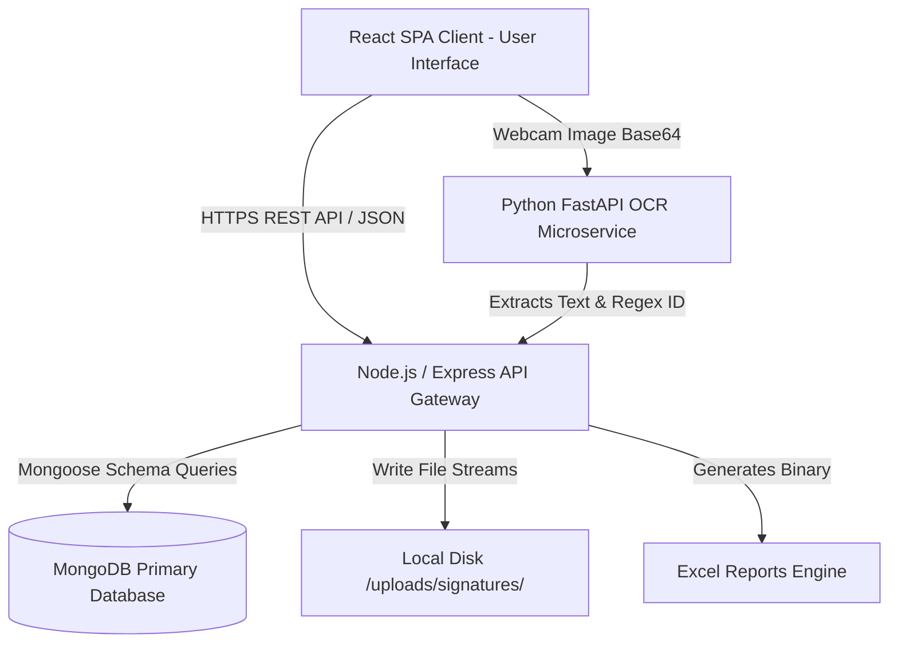

# PROVEXA: Enterprise Asset Management & OCR Handover Verification System

[](https://reactjs.org/)
[](https://nodejs.org/)
[](https://fastapi.tiangolo.com/)
[](https://github.com/JaidedAI/EasyOCR)
[](https://opencv.org/)
[](https://www.mongodb.com/)
[](https://tailwindcss.com/)

PROVEXA is a modern, enterprise-grade, SaaS-ready Employee Asset Management System. It digitizes the entire lifecycle of company assets—from initial issuing and cyclical renewals to damage replacements and final returns. 

At its core, PROVEXA solves a major corporate accountability problem by enforcing strict **handover verification protocols** using high-performance **Computer Vision (OCR)** and **Cryptographic Digital Signatures**.

---

## 📖 Table of Contents
1. [Executive Summary & Business Value](#1-executive-summary--business-value)
2. [Technology Stack: What, Why, and How?](#2-technology-stack-what-why-and-how)
   - [Frontend (React SPA)](#frontend-react-spa)
   - [Backend (Node.js API Gateway)](#backend-nodejs-api-gateway)
   - [Database Layer (MongoDB / SQL Server)](#database-layer-mongodb--sql-server)
   - [OCR Microservice (Python / FastAPI)](#ocr-microservice-python--fastapi)
3. [Deep Dive into Core Business Modules](#3-deep-dive-into-core-business-modules)
   - [Issues & Verification Workflow](#issues--verification-workflow)
   - [Replacements & Financial Deductions](#replacements--financial-deductions)
   - [Advanced Excel Reporting Engine](#advanced-excel-reporting-engine)
4. [System Architecture](#4-system-architecture)
5. [Installation & Execution Guide](#5-installation--execution-guide)
6. [Mobile & Tablet Local Network Setup](#6-mobile--tablet-local-network-setup)
7. [API Endpoints & Integration](#7-api-endpoints--integration)
8. [Enterprise Troubleshooting](#8-enterprise-troubleshooting)

---

## 1. Executive Summary & Business Value

In large organizations (manufacturing, logistics, corporate IT), tracking physical assets—such as laptops, security badges, custom-sized uniforms, and safety equipment—is critical. 

**The Problem**: Historically, asset handovers are managed via paper sign-off sheets or manual Excel inputs. This leads to lost items, forged signatures, lack of auditability, and massive headaches during offboarding or payroll deduction calculations.

**The Solution**: PROVEXA digitizes this entire flow. When HR issues an item, it sits in a "Pending" state. The employee must physically present themselves and either provide a **Digital Signature** on a tablet, or present their physical company ID card to a webcam, where PROVEXA's **Artificial Intelligence OCR (Optical Character Recognition)** validates their identity in milliseconds. Every transaction is legally and digitally bound to a timestamped audit log.

---

## 2. Technology Stack: What, Why, and How?

PROVEXA is built as a highly scalable microservices architecture. By separating the frontend, the core backend, and the AI OCR processing, we achieve maximum performance and maintainability.

### Frontend (React SPA)
* **What we used**: React.js 18 (built with Vite), Tailwind CSS, TanStack React Query, and native Web APIs.
* **Why we used it**: React allows us to build a Single Page Application (SPA) where the user never experiences full page reloads, providing a smooth, desktop-like software experience. Tailwind CSS allows for rapid, highly-customized UI design without writing messy external CSS files.
* **How it is implemented**:
  * **Collapsible Navigation (Sidebar)**: Supports tablet and mobile space optimization through a responsive collapsible sidebar layout. When collapsed, the workspace expands instantly while the navigation shrinks into icon-only mode with smooth `transition-all duration-300` animations.
  * **SLR Tap-to-Focus Camera**: Features an interactive tap-to-focus video controller. Tapping anywhere on the live camera viewport calculates clicked coordinates, triggers hardware autofocus capabilities (`focusMode: 'continuous'`), and flashes a professional pulsing yellow SLR-style target ring overlay.
  * **Dynamic Date & Status Sorting**: Optimizes data density by dynamically sorting all spreadsheets and tables with recent dates on top, grouping active/acknowledged records first.
  * **State Management**: We utilize TanStack Query for data fetching. It automatically caches API responses, retries failed requests, and provides immediate "optimistic updates" to the UI.
  * **Camera Integration**: We leverage standard HTML5 `navigator.mediaDevices.getUserMedia()` to tap into desktop webcams, tablet cameras, or mobile phone cameras directly from the browser to capture ID cards securely.

### Backend (Node.js API Gateway)
* **What we used**: Node.js, Express.js, JSON Web Tokens (JWT), Multer.
* **Why we used it**: Node.js utilizes an event-driven, non-blocking I/O model. This makes it exceptionally fast at handling thousands of simultaneous HTTP requests, database reads, and file uploads without freezing the server.
* **How it is implemented**:
  * **API Gateway**: Acts as the central traffic controller. It receives requests from React, validates the JWT authorization token, queries the database, and securely passes image data to the Python OCR service.
  * **File Storage (Multer)**: When a digital signature is captured, it is sent as a Base64 string. The backend converts this string into a secure `.png` image file and saves it to a protected `/uploads` directory, saving the file path string in the database to prevent database bloat.

### Database Layer (MongoDB / SQL Server)
* **What we used**: MongoDB (Primary NoSQL) via Mongoose ODM. (System is structurally prepared for Microsoft SQL Server enterprise migration).
* **Why we used it**: MongoDB’s document-based structure allows for incredibly flexible and rapid schema development. When an `Issue` is created, it can easily reference nested object IDs for the `Employee` and the `Item`. 
* **How it is implemented**: We use Mongoose to enforce strict schema validation. For example, an `Issue` document requires a quantity, an issued date, and ties directly to a specific employee ID. If HR tries to issue an item that doesn't exist, the schema rejects it, ensuring absolute data integrity.

### OCR Microservice (Python / FastAPI)
* **What we used**: Python, FastAPI, OpenCV, EasyOCR (PyTorch), NumPy.
* **Why we used it**: Node.js is excellent for web traffic, but terrible for heavy CPU-bound machine learning tasks. Python is the industry standard for AI. FastAPI provides an ultra-fast, async web server to expose the AI model as an API.
* **How it is implemented (The Computer Vision Pipeline)**:
  1. **Base64 Decode**: FastAPI receives the image from Node.js and decodes it into a NumPy multidimensional array (matrix) that OpenCV can understand.
  2. **CLAHE Normalization**: (Contrast Limited Adaptive Histogram Equalization) is applied. If an ID card is photographed in a dark room or with heavy window glare, CLAHE mathematically evens out the contrast so text pops clearly.
  3. **Sharpened Otsu Thresholding**: Converts the image into pure black and white pixels based on calculated lighting thresholds, stripping away colorful ID card backgrounds.
  4. **EasyOCR Processing**: A deep learning model analyzes the pixel patterns and extracts raw text.
  5. **Regex Extraction**: We use Regular Expressions (e.g., `(?:EMP[.-]?)?(\d{5})`) to search the raw text specifically for 4 or 5 digit patterns that match our company employee codes, discarding irrelevant text (like company address or logos).

---

## 3. Deep Dive into Core Business Modules

### Issues & Verification Workflow
**The Concept**: Handing out company property must be documented. 
**The Execution**:
1. **Allocation**: An HR admin assigns 2 Uniforms to Employee #11333. The database creates a record with `issue_status: "Pending Acknowledgement"`.
2. **Verification Modal**: The employee arrives at the desk. HR opens the Verification Modal, offering two legal proof methods.
3. **Digital Signature**: The employee draws their signature on a tablet. The React `<canvas>` element captures the stroke paths, converts them to an image, and saves it.
4. **OCR Verification**: Instead of signing, the employee holds up their ID badge to the webcam. The system captures the frame, sends it to the Python AI, extracts "11333", compares it against the database record, and instantly marks the item as **"Verified via OCR"**. This creates a frictionless, 1-second automated handover.

### Replacements & Financial Deductions
**The Concept**: Items get damaged or lost. Companies need to track the financial cost of replacing them and whether the employee owes the company money.
**The Execution**:
* When requesting a replacement, HR inputs the `Total Cost` and `Deduction Amount`.
* **State Tracking**: The system tracks the physical exchange. Did the employee return the torn uniform? (`Pending Return` vs `Returned`).
* **Payroll Ready**: The module displays clear financial badges (e.g., "₹1,500 - ₹500 Deduction"). At the end of the month, this exact data is exported for the payroll department to dock from salaries.

### Advanced Excel Reporting Engine
**The Concept**: Dashboards are great for viewing, but accounting, payroll, and auditing departments run on Microsoft Excel. We needed a way to provide pristine, raw data.
**The Execution**:
* **What we used**: The `exceljs` library on the Node backend.
* **How it works**: When a user clicks "Export" on the Reports page, the backend fetches thousands of Issue and Replacement records. It creates a binary Excel workbook in memory.
* **Data Resolution**: It converts meaningless database IDs (like `64ef2899...`) into human-readable strings ("Keerthana - EMP11333").
* **Deeply Populated Relations**: Patched database queries to perform nested Mongoose deep-population (`.populate({ path: 'item', populate: { path: 'category' } })`) so categories are resolved accurately instead of displaying `'N/A'`.
* **Automated Formatting**: It automatically calculates column widths based on text length, bolds the header row, adds background colors to cells, and streams the `.xlsx` file directly into the user's browser for download, entirely bypassing the need to store temporary files on the server.

---

## 4. System Architecture



---

## 5. Installation & Execution Guide

### Prerequisites
* **Node.js**: v18.0.0+
* **Python**: v3.9+ (For PyTorch/EasyOCR stability)
* **MongoDB**: Active local instance (Port 27017)

### Environment Setup
Create a `.env` in the `/server` directory:
```env
PORT=5000
JWT_SECRET=PROVEXA_ENTERPRISE_SECRET_KEY_2026
MONGODB_URL=mongodb://localhost:27017/provexa
OCR_SERVICE_URL=http://localhost:8001
```

### Running the System (3 Terminals Required)

**Terminal 1: Python AI Service**
```bash
cd ocr_service
python -m venv venv
venv\Scripts\activate      # Windows
# source venv/bin/activate # Mac/Linux
pip install -r requirements.txt
python -m uvicorn main:app --host 0.0.0.0 --port 8001
```

**Terminal 2: Node Backend**
```bash
cd server
npm install
npm run dev
```

**Terminal 3: React Frontend**
```bash
cd client
npm install
npm run dev
```
Open `http://localhost:5173` to access the application.

---

## 6. Mobile & Tablet Local Network Setup

To use PROVEXA's Digital Signature or Camera OCR features on a tablet (like an iPad) or a mobile phone, the devices must be connected to the same Wi-Fi network as the host server.

### Step 1: Expose the Frontend to the Local Network
By default, Vite only serves to `localhost`. You must expose it to your Local Area Network (LAN):
1. Open `client/package.json`.
2. Change your dev script from `"dev": "vite"` to `"dev": "vite --host"`.
3. Restart the React frontend. The terminal will output a **Network URL** (e.g., `http://192.168.1.100:5173`).

### Step 2: Ensure API Endpoints Point to the Network IP
If your phone connects to `192.168.1.100`, it cannot use `localhost` to hit the backend or OCR service (because `localhost` on a phone means the phone itself).
1. Update your React frontend API client (e.g., `/client/src/lib/api.js` or environment variables) to point to `http://192.168.1.100:5000` instead of `localhost:5000`.
2. Update the backend `.env` so that `OCR_SERVICE_URL=http://192.168.1.100:8001`.

### Step 3: Browser Permissions & HTTPS Requirements (CRITICAL)
Modern browsers (Chrome, Safari, iOS, Android) **strictly block** access to `navigator.mediaDevices.getUserMedia()` (the camera API) unless the site is loaded over a secure `https://` connection, EXCEPT for `localhost`.
Since your phone is accessing `192.168.1.100` (which is HTTP, not HTTPS), the camera will fail silently or throw a permission error.

**How to fix this for development/testing:**
* **Chrome (Android/Desktop/Tablet):**
  1. Open Chrome on the device.
  2. Type `chrome://flags/#unsafely-treat-insecure-origin-as-secure` in the URL bar.
  3. Enter your host IP (e.g., `http://192.168.1.100:5173`) in the text box.
  4. Enable the flag and click **Relaunch**.
* **Safari (iOS/iPad):**
  1. Testing on raw IPs via HTTP is strictly blocked. You must use a local tunneling service (like **ngrok** or **localtunnel**) which provides a temporary `https://` URL that tunnels securely back to your local port.

**Production Fix:** You must serve the React build over HTTPS using a reverse proxy (like NGINX or IIS) with a valid SSL certificate. Once served over HTTPS, the browser will automatically prompt the user with: *"PROVEXA wants to Use your Camera. [Allow] / [Block]"*.

---

## 7. API Endpoints & Integration

The backend provides a secure REST API. All endpoints (except Login) require a Bearer token in the Authorization header.

### Key Endpoints

| HTTP Method | Endpoint | Purpose |
| :--- | :--- | :--- |
| **POST** | `/api/auth/login` | Authenticates HR user, returns JWT. |
| **GET** | `/api/employees` | Fetches active workforce data. |
| **POST** | `/api/issues` | Creates a new asset allocation record. |
| **PATCH** | `/api/issues/:id/acknowledge` | Processes signature/OCR and locks record. |
| **GET** | `/api/reports/export` | Triggers backend Excel generation stream. |
| **POST** | `http://localhost:8001/ocr/scan` | Direct pipeline to Python AI image processor. |

### Postman Testing Flow
1. Hit `POST /api/auth/login` with your credentials.
2. Copy the `token` from the JSON response.
3. In Postman, go to the **Authorization** tab for your request, select **Bearer Token**, and paste.
4. For the **Excel Report**, hit `GET /api/reports/export`. Instead of clicking "Send", click the dropdown arrow and select **Send and Download** to save the actual `.xlsx` file.

---

## 7. Enterprise Troubleshooting

#### Issue: PyTorch / EasyOCR Fails to Install on Windows
**Why it happens**: Python PIP attempts to compile C++ libraries from source if pre-compiled binaries aren't found for your system architecture.
**Solution**: Force install the pre-compiled CPU wheel directly from PyTorch servers:
```bash
pip install torch torchvision torchaudio --index-url https://download.pytorch.org/whl/cpu
pip install easyocr
```

#### Issue: `[winerror 10048] only one usage of each socket address`
**Why it happens**: You closed a terminal window, but the Node or Python process is still running silently in the background, holding port 5000 or 8001 hostage.
**Solution**: Kill the ghost process:
```powershell
netstat -ano | findstr :5000
taskkill /PID <PID_NUMBER> /F
```

#### Issue: Webcam Not Activating in Browser
**Why it happens**: Modern browsers (Chrome, Safari, Edge) strict-block `getUserMedia()` access on non-secure origins to prevent spying.
**Solution**: The application must be accessed via `http://localhost` or served over a valid `https://` SSL certificate. Local network IPs (e.g. `http://192.168.1.5`) will block the camera unless SSL is configured or the IP is added to the browser's "Insecure origins treated as secure" flag.

---

**Developed for absolute operational excellence. PROVEXA brings industrial asset accountability into the AI era.**
