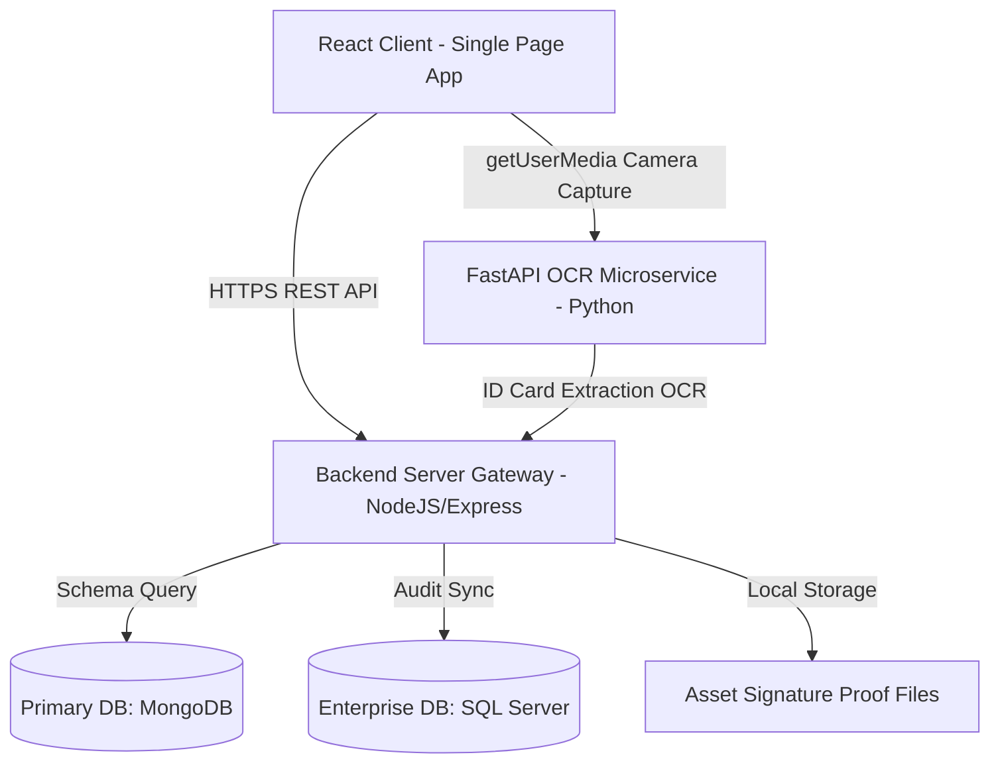

# PROVEXA: Enterprise Asset Management & OCR Handover Verification System

[](https://reactjs.org/)
[](https://nodejs.org/)
[](https://fastapi.tiangolo.com/)
[](https://github.com/JaidedAI/EasyOCR)
[](https://opencv.org/)
[](https://www.mongodb.com/)
[](https://www.microsoft.com/sql-server)

PROVEXA is a modern, enterprise-grade, SaaS-ready Employee Asset Issue, Renewal, Replacement, and AI-Driven Verification Management System. Designed for organizations needing flawless accountability, PROVEXA digitizes and enforces strict asset handover protocols using high-performance **EasyOCR Computer Vision Identity Extraction** and **Cryptographic/Biometric Digital Signature Verification**.

The entire system is responsive, robust, and optimized for deployment across Desktops, Tablet webcams, Laptop cameras, and Mobile browsers.

---

## 📖 Table of Contents
1. [Project Overview](#-project-overview)
2. [Key Features](#-key-features)
3. [System Architecture](#-system-architecture)
4. [Technology Stack](#-technology-stack)
5. [System Modules](#-system-modules)
6. [Folder Structure](#-folder-structure)
7. [Environment Variables Configuration](#-environment-variables-configuration)
8. [Database Setup & Configurations](#-database-setup--configurations)
9. [Installation & Execution Guide](#-installation--execution-guide)
10. [Detailed API Endpoints Documentation](#-detailed-api-endpoints-documentation)
11. [Postman Testing & API Integration Guide](#-postman-testing--api-integration-guide)
12. [Core Workflows & Handover Protocols](#-core-workflows--handover-protocols)
13. [OCR Technical Architecture Details](#-ocr-technical-architecture-details)
14. [Security & Compliance Engineering](#-security--compliance-engineering)
15. [UI/UX & Interactive Design System](#-uiux--interactive-design-system)
16. [Enterprise Troubleshooting Guide](#-enterprise-troubleshooting-guide)
17. [Future Enhancements](#-future-enhancements)
18. [License & Developer Info](#-license--developer-info)

---

## 🌟 Project Overview

Managing physical employee assets—ranging from technical laptops and security cards to critical custom uniforms, shoes, and dietary nutrition kits—has historically suffered from a lack of secure audit trails. Handover verifications are easily forged, and spreadsheets fail to enforce cycle tracking.

**PROVEXA solves this challenge** by introducing an integrated double-verification framework:
* **Digital Signatures**: Captures real-time touchscreen/mouse-drawn hand signatures with timestamp logging.
* **OCR Employee ID Verification**: Leverages real-time cameras (webcams, mobile, or tablets) to extract employee identifiers from physical ID cards using OpenCV image processing and EasyOCR. It matches characters against active databases to confirm handovers in under 300 milliseconds.

---

## ✨ Key Features

* **High-Accuracy OCR ID Scanner**: Process physical employee IDs dynamically using a custom dual-pass image preprocessing pipeline (CLAHE color balance + Otsu adaptive thresholding + Image sharpening).
* **Cross-Device Camera Support**: Full support for native mobile browsers, tablets, and desktop webcams via `navigator.mediaDevices.getUserMedia()`.
* **Sleek, Compact Layouts**: Built-in viewport bounds (`max-h-[500px]`) and sticky column headers (`sticky top-0`) to eliminate endless vertical page scrolls.
* **Financial Deduction Tracking**: Seamlessly tracks item replacements, employee damage reports, custom sizes (e.g. shoes, uniform sizing), and direct payroll deductions (salary offsets).
* **Excel Reports Engine**: Highly advanced reporting module generating professional worksheets with automated auto-fitting, total formulas, and multi-tab categorization via `exceljs`.
* **Multi-Database Support**: Native support for **MongoDB** (primary NoSQL schema) and pre-engineered mapping hooks for **Microsoft SQL Server** (for secure enterprise migration).
* **Security First**: Absolute route guards via JSON Web Tokens (JWT), robust CORS configurations, and high-performance server-side file verification.

---

## 🏗️ System Architecture

PROVEXA is built as a highly decoupled microservices architecture to guarantee performance, scaling, and modular maintenance.



### Flow Breakdown:
1. **Request Phase**: The HR officer opens the verification screen. The React frontend accesses the device's camera stream to capture a snapshot of the employee's ID.
2. **OCR Pre-Processing Phase**: The image is posted as a Base64 payload to the FastAPI microservice. The service isolates the ID region, normalizes contrast, and runs EasyOCR.
3. **Database Validation Phase**: The extracted employee code is returned to the React frontend, which requests an instant confirmation from the backend. The backend matches the record against MongoDB/SQL Server, marks the asset as verified, and archives the signature path.

---

## 🛠️ Technology Stack

### Frontend (SPA)
* **Core Framework**: React.js 18 (Vite-powered for instant bundling)
* **Data Queries**: TanStack React Query v5 (Optimized object-based caching)
* **CSS System**: Tailwind CSS (Custom color system, glassmorphism shadows)
* **Date Utilities**: Day.js (For due calculations, next cycle tracking)
* **Icons**: Lucide React
* **Network**: Axios (Interceptors for automatic JWT header attachments)

### Backend (REST API)
* **Runtime**: Node.js & Express.js
* **Authentication**: JWT (JSON Web Tokens) with Secure Cookie/Header verification
* **File Uploads**: Multer (Disk storage structure)
* **Excel Processor**: ExcelJS
* **Database Driver**: Mongoose (MongoDB) / Tedious & mssql (SQL Server)

### Computer Vision OCR Microservice
* **Framework**: FastAPI (Asynchronous request handling, Pydantic type checking)
* **Image Processing**: OpenCV (Open Source Computer Vision Library)
* **Deep Learning Engine**: EasyOCR (PyTorch-based text extraction)
* **Image Parsing**: NumPy (Matrix mathematical operations)

---

## 📂 Folder Structure

```
PROVEXA/
├── client/                     # React Frontend Single Page Application
│   ├── src/
│   │   ├── components/         # Reusable UI (Modal, Button, IssueForm, etc.)
│   │   ├── lib/                # API Client Configurations (axios setup)
│   │   ├── pages/              # Page modules (Issues, ItemRenewal, Replacements, Employees, Reports, etc.)
│   │   ├── App.jsx             # Main Router and State Manager
│   │   ├── index.css           # Global Custom Scrollbars & Tailwind Configs
│   │   └── main.jsx
│   ├── package.json
│   └── vite.config.js
│
├── server/                     # NodeJS Express Core Backend
│   ├── config/                 # Database connection configurations (db.js / sql.js)
│   ├── middleware/             # Auth Verification, Request Logs, File Filters
│   ├── models/                 # Database Schemas (Employee, Item, Issue, Replacement, etc.)
│   ├── routes/                 # Express Router Endpoints
│   ├── uploads/                # Signature proof file directories
│   ├── .env.example
│   ├── package.json
│   └── server.js
│
└── ocr_service/                # Python Computer Vision Microservice
    ├── main.py                 # FastAPI Application with OCR pipeline
    ├── requirements.txt        # Python library dependencies
    └── test_images/            # Pre-loaded mock images for test execution
```

---

## ⚙️ Environment Variables Configuration

Create a `.env` file in the root of the `/server` directory:

```env
# Server Network Settings
PORT=5000
NODE_ENV=production

# JSON Web Token Secret
JWT_SECRET=PROVEXA_SECURE_JWT_ENCRYPTION_HASH_KEY_2026

# Primary Database Connection String
MONGODB_URL=mongodb://localhost:27017/provexa

# SQL Server Integration Settings (Enterprise Optional)
SQL_SERVER=localhost
SQL_DATABASE=provexa_enterprise
SQL_USER=sa
SQL_PASSWORD=EnterprisePasswordSecure123!
SQL_TRUST_SERVER_CERTIFICATE=true

# Python Microservices URL
OCR_SERVICE_URL=http://localhost:8001
```

---

## 🗄️ Database Setup & Configurations

### 1. MongoDB Setup (Primary)
PROVEXA works out-of-the-box with MongoDB. 
1. Install **MongoDB Community Server** local database from the official website.
2. Start the service (runs on default port `27017`):
   ```bash
   net start MongoDB
   ```
3. The database connection will automatically initialize the `provexa` collection structures upon backend launch.

### 2. SQL Server Configuration (Enterprise Migration)
To bind the system to enterprise-grade MS SQL Server:
1. Enable SQL Server authentication mode (SQL & Windows Auth).
2. Create a blank database named `provexa_enterprise`.
3. Enable SQL TCP/IP Protocols on port `1433` via **SQL Server Configuration Manager**.
4. In `/server/config/db.js`, toggle the initialization flag to active SQL queries. The schema tables (`Employees`, `Items`, `Issues`, `Replacements`) will be automatically synchronized.

---

## 🚀 Installation & Execution Guide

### Prerequisite Checklist
* **Node.js**: v18.0.0 or higher
* **npm**: v9.0.0 or higher
* **Python**: v3.9.0 to v3.11.0 (Recommended for PyTorch and OpenCV compatibility)
* **MongoDB**: Active instance running

---

### Step-by-Step System Launch

#### 1. Launch the Python OCR Microservice
Navigate to `/ocr_service` directory:
```bash
cd ocr_service

# Create a virtual environment
python -m venv venv

# Activate the virtual environment
# On Windows:
venv\Scripts\activate
# On Linux/macOS:
source venv/bin/activate

# Install essential dependencies
pip install -r requirements.txt

# Start the FastAPI server on Port 8001
python -m uvicorn main:app --host 0.0.0.0 --port 8001
```

#### 2. Launch the NodeJS Backend Server
Navigate to `/server` directory:
```bash
cd server

# Install node dependencies
npm install

# Start the development server (runs on Port 5000)
npm run dev
```

#### 3. Launch the React Frontend Single Page App
Navigate to `/client` directory:
```bash
cd client

# Install packages
npm install

# Start the local development web server
npm run dev
```
Open [http://localhost:5173](http://localhost:5173) in your preferred web browser to access the SaaS panel.

---

## 🔌 Detailed API Endpoints Documentation

| HTTP Method | Endpoint | Description | Auth Required |
| :--- | :--- | :--- | :--- |
| **POST** | `/api/auth/login` | HR Officer Login Authentication | No |
| **GET** | `/api/employees` | Fetch and query employee listings | Yes (JWT) |
| **POST** | `/api/employees` | Register new employee record | Yes (JWT) |
| **GET** | `/api/items` | List of items available for allocation | Yes (JWT) |
| **POST** | `/api/issues` | Distribute assets/items to employees | Yes (JWT) |
| **PATCH** | `/api/issues/:id/acknowledge` | Sign and verify asset handover | Yes (JWT) |
| **GET** | `/api/replacements` | Fetch replacement requests | Yes (JWT) |
| **POST** | `/api/replacements` | File item replacement claim | Yes (JWT) |
| **GET** | `/api/reports/export` | Download auto-formatted Excel reports | Yes (JWT) |
| **POST** | `http://localhost:8001/ocr/scan` | OpenCV base64 image parsing (OCR) | No |

---

### Sample Request/Response Payloads

#### 1. HR Officer Authentication (`POST /api/auth/login`)
* **Request JSON**:
  ```json
  {
    "username": "admin",
    "password": "password123"
  }
  ```
* **Success Response (200 OK)**:
  ```json
  {
    "success": true,
    "token": "eyJhbGciOiJIUzI1NiIsInR5cCI6IkpXVCJ9...",
    "user": {
      "id": "64ef2899",
      "username": "admin",
      "role": "SuperAdmin"
    }
  }
  ```

#### 2. OCR ID Scanner Service (`POST http://localhost:8001/ocr/scan`)
* **Request JSON**:
  ```json
  {
    "image": "data:image/png;base64,iVBORw0KGgoAAAANSUhEUgAAAGQ..."
  }
  ```
* **Success Response (200 OK)**:
  ```json
  {
    "success": true,
    "emp_code": "11333",
    "raw_texts": ["PROVEXA CORP", "Emp.No: 11333", "Name: Keerthana", "Dept: QA"],
    "process_time_seconds": 0.285
  }
  ```

#### 3. Asset Handover Acknowledgement (`PATCH /api/issues/:id/acknowledge`)
* **Request JSON**:
  ```json
  {
    "acknowledged": true,
    "signature_data": "data:image/png;base64,iVBORw0KGgoAAA...",
    "verification_method": "OCR ID Scan",
    "ocr_emp_code": "11333"
  }
  ```
* **Success Response (200 OK)**:
  ```json
  {
    "success": true,
    "message": "Asset handover successfully verified and archived.",
    "signature_path": "/uploads/signatures/sign_64ef2981.png"
  }
  ```

---

## 📮 Postman Testing & API Integration Guide

Testing dynamic features like base64 signature submissions and image files uploading requires specific setups in Postman.

### Setting Up Authentication Headers
1. Authenticate using the `/api/auth/login` endpoint.
2. Copy the resulting `token` string.
3. In your active Postman folder, navigate to **Authorization** -> Select **Bearer Token** -> Paste the token. It will apply to all subsequent queries.

### Testing OCR Scanner (FastAPI API)
1. Set HTTP request method to `POST` and set target URL to `http://localhost:8001/ocr/scan`.
2. Under the **Headers** tab, add `Content-Type: application/json`.
3. Under the **Body** tab, choose **raw** -> **JSON**.
4. Paste the JSON request carrying a Base64 string payload:
   ```json
   {
     "image": "data:image/jpeg;base64,/9j/4AAQSkZJRgABAQEA..."
   }
   ```
5. Click **Send** to view extracted data.

### Testing Excel Export Download
1. Send a `GET` request to `/api/reports/export`.
2. Ensure you have the `Authorization` header attached.
3. In Postman, instead of clicking "Send", click the dropdown next to it and select **Send and Download**. Save the file as `provexa_report.xlsx`.

---

## 🔄 Core Workflows & Handover Protocols

```
               ┌───────────────────────────────────────────┐
               │    HR Allocates Item to Employee          │
               └─────────────────────┬─────────────────────┘
                                     │
                                     ▼
               ┌───────────────────────────────────────────┐
               │   Employee Proceeds to Signature Screen   │
               └─────────────────────┬─────────────────────┘
                                     │
                  ┌──────────────────┴──────────────────┐
                  ▼                                     ▼
      ┌───────────────────────┐             ┌───────────────────────┐
      │   Digital Signature   │             │   OCR ID Verification │
      └───────────┬───────────┘             └───────────┬───────────┘
                  │                                     │
                  │   Touchscreen drawing captured      │   Camera takes snapshot of ID
                  │   and posted as Base64 payload.     │   FastAPI processes CV steps.
                  │                                     │   Employee Code validated.
                  └──────────────────┬──────────────────┘
                                     │
                                     ▼
               ┌───────────────────────────────────────────┐
               │  System matches ID details with database  │
               └─────────────────────┬─────────────────────┘
                                     │
                                     ▼
               ┌───────────────────────────────────────────┐
               │  Status set to Verified / Proof Archived  │
               └───────────────────────────────────────────┘
```

---

## 🧠 OCR Technical Architecture Details

Our OCR service features a tailored Computer Vision pipeline developed for high stability on office ID cards.

### The 5-Step Computer Vision Pipeline

```
┌──────────────┐    ┌─────────────────┐    ┌─────────────────┐    ┌──────────────┐    ┌──────────────┐
│ Base64 Image │───>│ Grayscale/Otsu  │───>│ Dual-Pass CLAHE │───>│ PyTorch Text │───>│ Regex Filter │
│ Stream Input │    │ Adaptive Thres. │    │ Contrast Boost  │    │  Extraction  │    │ Match Return │
└──────────────┘    └─────────────────┘    └─────────────────┘    └──────────────┘    └──────────────┘
```

1. **CLAHE Color Contrast Normalization**: Enhances subtle text differences in poorly lit capture environments.
2. **Sharpened Otsu Dual-Threshold Binarization**: Dual-pass checks run over the image matrix to separate background glare from foreground text.
3. **Region of Interest (ROI) Dynamic Cropping**: Minimizes the processing bounds by cropping out outer edge details (5% margin filters).
4. **PyTorch Deep Learning Evaluation**: Runs PyTorch character detection and joins segmented horizontal tokens.
5. **Regex Employee Identifier Matching**:
   * Evaluates strings using patterns designed to capture employee codes: `(?:EMP[.-]?)?(\d{5})` or `(?:EMP[.-]?)?(\d{4})`.
   * Standardizes alphanumeric codes (e.g. `EMP11333`) to target outputs like `11333`.

---

## 🛡️ Security & Compliance Engineering

* **JWT Route Enforcements**: Any requests outside authentication are locked and require robust authorization.
* **CORS Policies**: Strict configurations on the Express and FastAPI gateways allow only designated origins to protect against Cross-Origin attacks.
* **Storage Encryption**: Handover signature paths are hashed and saved under custom path models to prevent malicious directory traversals.
* **Stable Capture-Trigger Action**: The scanner works via triggered user snapshot actions instead of aggressive live-frame reading. This saves battery power, minimizes API spamming, and provides maximum accuracy.

---

## 🎨 UI/UX & Interactive Design System

PROVEXA boasts a sleek, state-of-the-art interface tailored for high accessibility and premium feel:
* **Glassmorphism Components**: Translucent backdrop blurring, harmonic shadows, and sleek borders.
* **Dynamic Table Density**: Table boundaries restricted to `500px` with sticky table headers so that tracking views stay tidy and comfortable.
* **Status Badging**: High-impact, color-coded visual indicator chips for instant tracking (e.g., green for Verified, amber for Pending, blue for Processed).
* **Smooth Micro-animations**: Transitions, interactive scaling on buttons, and fade-in visual components.

---

## 🩺 Enterprise Troubleshooting Guide

#### 1. EasyOCR Python Installation Fails
* **Cause**: PyTorch dependency compatibility conflict or missing compiler tools on Windows systems.
* **Resolution**: Install standard CPU-based PyTorch first:
  ```bash
  pip install torch torchvision torchaudio --index-url https://download.pytorch.org/whl/cpu
  pip install easyocr
  ```

#### 2. Backend Port Conflict: `[winerror 10048] only one usage of each socket address`
* **Cause**: An active FastAPI (8001) or NodeJS (5000) server process was left running in the background.
* **Resolution**: Kill the existing task holding the port:
  ```powershell
  # Locate PID using netstat:
  netstat -ano | findstr :8001
  # Kill task using PID:
  taskkill /PID <PID_NUMBER> /F
  ```

#### 3. Frontend Camera Fails to Access Device
* **Cause**: Browsers block camera access unless served over secure `https://` contexts or localhost.
* **Resolution**: Ensure your domain runs on `localhost` or set up local self-signed SSL certificates for mobile browser testing over local networks.

---

## 🔮 Future Enhancements

* **Facial Verification Integration**: Supplementing ID cards scanning with facial match authentication for biometric verification.
* **Offline Fallback Queues**: Local client-side sync caching using IndexedDB when connection drops in offsite hubs.
* **Native Android/iOS Mobile Wrapper**: Packaging the single page client using Capacitor / Cordova to leverage native device camera drivers.

---

## 👥 License & Developer Info

Developed with ❤️ for organizations aiming for absolute operational excellence.

**Project Developer**: PROVEXA Engineering Team  
**Documentation Version**: 6.1 (Enterprise Ready)  
**Academic Submission / Showcase Code**: SECURE-ID-6.1  
*For questions or enterprise migration support, open a pull request on your organization's repository panel.*
